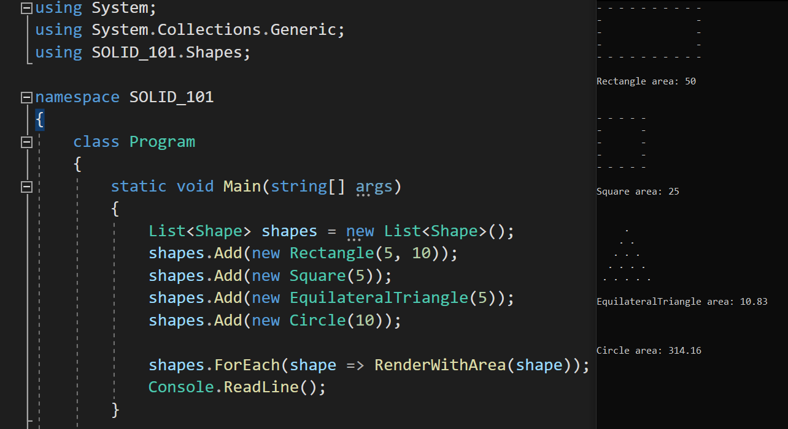

# SOLID_101
SOLID_101 is a study project using .net core 3.1 that aims to implement geometric shapes and their attributes using the five S.O.L.I.D principles.  
Mastering these principles alongside object-orientation programming fundamentals will help you to build a better, reusable, extensible and more expressive code.

 

 

<h2>The 5 principles of S.O.L.I.D are:<h2>

### S: Single-responsibility principle
A class should only have a single responsibility, that is, only changes to one part of the software’s specification should be able to affect the specification of the class.
  

### O: Open-closed principle
Software entities should be open for extension, but closed for modification.
  

### L: Liskov substitution principle
Objects in a program should be replaceable with instances of their subtypes without altering the correctness of that program.
  

### I: Interface segregation principle
Many client-specific interfaces are better than one general-purpose interface.
  

### D: Dependency inversion principle
One should depend upon abstractions, [not] concretions.
  

Reference: https://www.educative.io/blog/solid-principles-oop-c-sharp
