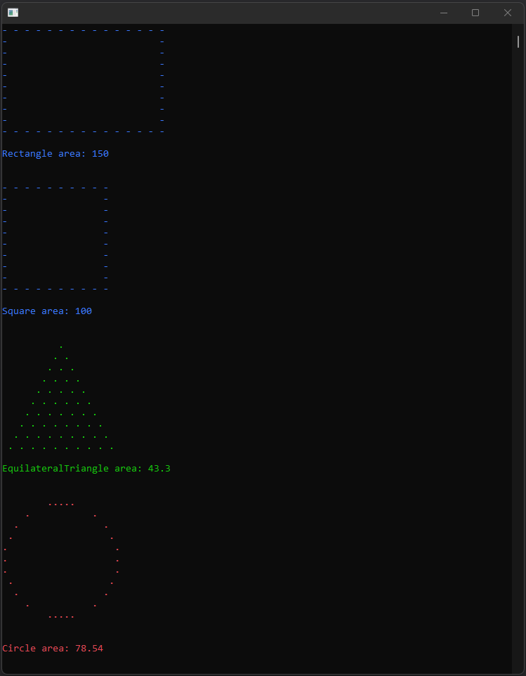

# SOLID 101

`SOLID 101` is a study project using .NET 8.0 and C# to showcase all five SOLID principles.

Check the <a href="https://falberthen.github.io/posts/solid101-pt1/" target="_blank">blog</a> for a detailed walkthrough.
 
 

 

The 5 SOLID principles are:
---
#### <a href="https://en.wikipedia.org/wiki/Single-responsibility_principle" target="_blank">S - Single-responsibility principle</a>
> A class should have a single responsibility.

#### <a href="https://en.wikipedia.org/wiki/Open%E2%80%93closed_principle" target="_blank">O - Open-closed principle</a>
> Classes should be open for extension, but closed for modification.

#### <a href="https://en.wikipedia.org/wiki/Liskov_substitution_principle" target="_blank">L - Liskov Substitution principle</a>
> If S is a subtype of T, then objects of type T in a program may be replaced with objects of type S without altering any of the desirable properties of that program.

#### <a href="https://en.wikipedia.org/wiki/Interface_segregation_principle" target="_blank">I - Interface segregation principle</a>
> Clients should not be forced to depend on methods that they do not use.

#### <a href="https://en.wikipedia.org/wiki/Dependency_inversion_principle" target="_blank">D - Dependency Inversion principle</a>
> High-level modules should not depend on low-level modules. Both should depend on abstractions.
  Abstractions should not depend on details. Details should depend on abstractions.

 

References: 
---

- https://www.educative.io/blog/solid-principles-oop-c-sharp
- https://sites.google.com/site/unclebobconsultingllc/getting-a-solid-start
- https://medium.com/backticks-tildes/the-s-o-l-i-d-principles-in-pictures-b34ce2f1e898
